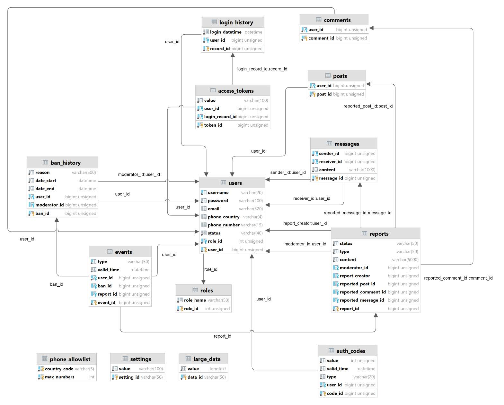

# Geo-SM-CMS
### A simple **CMS** for social media website where every post can have **geolocation** attached.
### Images in *Docker Hub* repository: *https://hub.docker.com/r/kwyzgol/pd-webapp/tags*
### Created by Kamil Wyżgoł

## Navigation
- [Description](#description)
- [Features](#features)
- [Installation (web app)](#installation-web-app)
- [Installation (mobile app) (optional)](#installation-mobile-app-optional)
- [GitHub Actions configuration](#github-actions-configuration)
- [Sample screenshots](#sample-screenshots)
- [Sample project architecture diagrams](#sample-project-architecture-diagrams)


## Description
- A simple **CMS** for social media website where every post can have **geolocation** attached.
- Personal data, including login information, login history, and messages, are stored in a **MySQL** database.
- Social media data such as posts, likes, and dislikes are managed through the **Neo4j** database.
- The mobile app is capable of sending authentication SMS messages to users, enhancing security with **two-factor authentication**.
- DevOps with **GitHub Actions**:
  - CI/CT/CD pipeline,
  - installation on Debian-based Linux systems via SSH,
  - SSL certificate renewal,
  - Nginx server configuration.
- The entire system uses **Docker** containers for seamless component communication.

## Features

- **User and Content Management**
  - Stores information on users, posts, tags, comments, account blocks, content reports, verification codes, verified information, and system settings.

- **Posts and Interactions**
  - Allows adding and displaying posts, comments, and messages.
  - Enables attaching images to posts and changing user avatars.

- **Content Filtering**
  - Allows filtering post visibility in two modes: ``newest`` or ``the best in the last 24 hours``.
  - Offers post visibility filtering based on selected location and distance.

- **Content Searching**
  - Enables displaying posts by a specific user or containing certain tags.
  - Offers content searching (posts, tags, users).

- **Authentication and Security**
  - Allows user registration and login.
  - Generates and verifies the correctness of authorization codes.
  - Sends verification codes via email or the mobile application.
  - Maintains a connection between the web and mobile applications.
  - Verifies human user authenticity (reCAPTCHA integration).

- **Content Moderation**
  - Allows users with proper permissions to delete created content.
  - Provides the ability to add verified information to posts.
  - Allows reporting inappropriate content or manipulation.

- **Privacy and Reputation Management**
  - Prevents indexing of content created by users with a specified reputation.
  - Automatically reports posts from users with a certain reputation.

## Installation (web app)
```
docker run [--env=VAR_NAME=VAR_VALUE] -p <PORT>:80 -d kwyzgol/pd-webapp:latest
```

The command by default pulls the image from the Docker Hub repository (if it cannot find it locally) and creates and runs a container containing the web application. The phrase ``<PORT>`` should be replaced with the port number on which access to the web application is to be provided. ``VAR_NAME`` and ``VAR_VALUE`` respectively denote the name and value of the environmental variable. The section ``[--env=VAR_NAME=VAR_VALUE]`` should be repeated (without the square brackets) for each required environmental variable. These variables, along with explanations, are presented below:

| Variable               | Meaning |
|------------------------|---------|
| `ASPNETCORE_ENVIRONMENT` | The environment type where the app is running. Use `Production` for live and `Development` for testing. |
| `MYSQL_HOSTNAME`       | Address of the MySQL database server. |
| `MYSQL_DATABASE`       | Name of the MySQL database to use. |
| `MYSQL_USER`           | Username for the MySQL database. |
| `MYSQL_PASSWORD`       | Password for the MySQL database. |
| `NEO4J_HOSTNAME`       | Address of the Neo4j database server. |
| `NEO4J_USER`           | Username for the Neo4j database. |
| `NEO4J_PASSWORD`       | Password for the Neo4j database. |

## Installation (mobile app) (optional) 


To install the mobile app, first download it from the project's repository. For this purpose, go to the [https://github.com/kwyzgol/PD](https://github.com/kwyzgol/PD) address. After loading the repository page, select the Actions tab from the top navigation menu.


Next, from the list of all workflows, select the one named ``Test, build, and deploy``. This workflow is responsible for creating an installation file with the ``.apk`` extension.


After choosing the appropriate workflow, a list of its past runs is displayed. Each record has on the left side a graphic representation of the outcome. Only a successfully completed workflow results in the creation of an installation file. It is recommended to select the first record from the top that ended successfully (this will be the latest version).


After selecting a specific record, you are taken to the details of its execution. At the bottom of the page, there should be a panel titled ``Artifacts``, containing the archive with the ``.apk`` file. It should be downloaded, extracted, and transferred to the mobile device.


Once the appropriate installation file is on the mobile device, proceed to try to install the mobile app. During this step, there may be issues related to the automatic blocking of the installation process due to the potential risk posed by an unknown ``.apk`` file.


After successful installation and launch of the app, a dialog box may appear requesting permissions related to sending and displaying SMS messages. This should be allowed. Failure to grant such permission will prevent the app from functioning correctly.


## GitHub Actions configuration

### Workflows:
| Action               | Description                                                                                         | Invocation                       |
|----------------------|-----------------------------------------------------------------------------------------------------|----------------------------------|
| **Configure nginx**  | Enables the creation and configuration of an nginx server container and requests an SSL certificate for the specified domain. | On demand.                       |
| **Delete nginx**     | Removes the nginx container and any data left by it.                                                | On demand.                       |
| **Renew SSL certificate** | Renews the SSL certificate.                                                                         | Automatically (every Monday at 03:00) and on demand. |
| **Run tests**        | Creates database containers, then performs unit and integration tests.                              | Use in another workflow or on demand. |
| **Create images**    | Creates an image of the web application, then publishes it to Docker Hub and GitHub Packages.       | Use in another workflow or on demand. |
| **Create ``.apk`` file** | Creates the mobile application's installation file and places it as a result of the workflow.       | Use in another workflow or on demand. |
| **Deploy**           | Creates or updates web application and database containers.                                         | Use in another workflow or on demand. |
| **Test, build and deploy** | Triggers the ``Run tests``, ``Create .apk file``, ``Create images``, and ``Deploy`` workflows.              | Pushing changes to the main branch, submitting a tag starting with ``v``, or on demand. |

### Used repository secrets:
| Variable                          | Meaning                                                       |
|-----------------------------------|---------------------------------------------------------------|
| ``PLACEHOLDER_MYSQL_ROOT_PASSWORD`` | The password that must be set for the user named ``root``, who is the administrator of the MySQL database. |
| ``PLACEHOLDER_NEO4J_AUTH``          | The password that must be set for the user named ``neo4j``, who is the administrator of the Neo4j database. |
| ``VPS_HOST``                        | The network address of the computer (or VPS type service) on which the system is to be installed. |
| ``VPS_PASSWORD``                    | The password for the computer's user.          |
| ``VPS_PORT``                        | The connection port for the SSH protocol.                     |
| ``VPS_USERNAME``                    | The username of the computer's user.                  |

### Example diagram of the ``Test, build and deploy`` execution (CI-CT-CD pipeline)


## Sample screenshots
### Main page:

### Color variations:

### Settings page

### Comments panel

### Two-factor authentication form

### Location select form


## Sample project architecture diagrams
### UML deployment diagram:

### UML state diagram (for registration process):

### UML use case diagram (for an unauthenticated user):

### ERD diagram for relational database structure:

### Real structure of the relational database:

### Graph database (Neo4j) schema:
